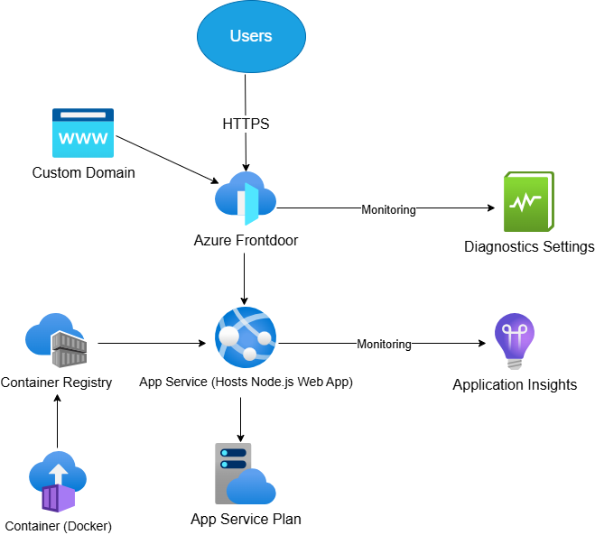

# Azure App Service with Frontdoor integration and Monitoring
Project provisions an Azure App Service (Node.js web app) behind Azure Frontdoor with 
custom domain, HTTPS (Managed Certificate), access restriction via service tag, DNS configuration, and monitoring integration using Azure Monitor and Application Insight.
Infrastructure is Deployed using Terraform. 

# Current Features
- Azure App Service (Linux, Node.js stack)
- Azure Front Door Standard/Premium (AFD)
- Custom domain with HTTPS (managed certificate)
- DNS integration via Azure DNS
- Traffic restriction using via Frontdoor service tag
- Monitoring with Azure Monitor, Application Insight
- Two CI/CD pipeline using GitHub Actions
- Terraform remote backend 

# Prerequisites
- Azure Subscription
- Azure CLI logged in (az login)
- Terraform CLI
- Azure AD App Registration (Client ID, Secret)
- Service Principal with:
  - Contributor role on resources
- For Terraform remote backend, a terraform.io account is required to setup orgainisation, workspace and generate user tokens for github, etc 

- GitHub repository with secrets:
ARM_CLIENT_ID,
ARM_CLIENT_SECRET,
ARM_TENANT_ID,
ARM_SUBSCRIPTION_ID

# DNS Setup
Ensure a CNAME record is registered.
- Example: Name: www.chinwetechhub.com Type: CNAME, 
Value: <your-frontdoor-endpoint>.azurefd.net

# GitHub Actions CI/CD
The Terraform cli pipeline does: on push to main branch
- Login to Azure via OIDC
- Runs terraform init
- Runs terraform plan
- Runs terraform apply

The Deployment Pipeline does: on push to main branch
- Login to Azure
- Builds the docker container image
- Pushes the image to Azure Container Registry
- Deploys the application to App Service
- Restarts App Service

# Monitoring
- Azure Monitor/Application Insight configured for App Service & Front Door

# Architecture Summary

User --> Front Door --> App Service (Linux)  
    \--> Custom Domain used:(www.chinwetechhub.com)
    \--> Access restricted to Front Door only via service tag (Only traffic from Azure Frontdoor is allowed)

# Achitecture Diagram

# License
© ChinweTechHub